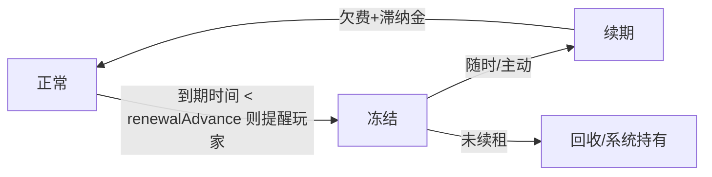
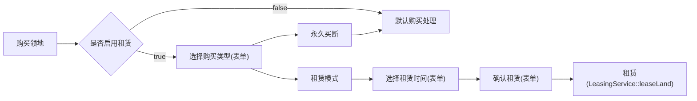

# Leasing Model - 租赁模式

> https://github.com/IceBlcokMC/PLand/issues/154

- 领地买断制导致玩家一次性投入后永久持有
- 缺乏持续的经济消耗渠道
- 无法有效清理不活跃玩家的领地

引入双模式并行：

- 购买模式：现有模式，永久持有
- 租赁模式：新增模式，期限持有，定期付费

## 租赁模式

| 维度    | 购买模式  | 租赁模式      |
|-------|-------|-----------|
| 所有权性质 | 永久持有  | 期限租用      |
| 付费方式  | 一次性买断 | 周期性租金     |
| 续期机制  | 无需续期  | 到期续租      |
| 转让    | 支持    | 支持(非欠费状态) |
| 子领地   | 支持    | 不支持       |
| 过期处理  | 无     | 冻结 → 清理   |



- 正常期 (**Active**)：与现有的买断制领地行为完全一致。
- 冻结期 (**Frozen**)：
    - `Owner`、`Member` 降级为 `Guest`，并同步禁止 `Owner` 修改领地任何设置(GUI)
- 被回收 (**Expired**)：
    - 领地所有权转移给 `System`（便于服主后续手动处理或作为遗迹）。

> PLand 不修改、干涉权限表，保证冻结后领地照常运行(不影响生电)，但 `Owner`、`Member` 降级为 `Guest`

| 宿主类型 | 子领地类型 | 问题                                                |
|:-----|:------|:--------------------------------------------------|
| 租赁   | 租赁    | 禁止创建子领地(租赁性质的土地，其所有权本身就是临时,划分永久或临时的子领地在逻辑上极易引发灾难) |
| 租赁   | 购买    | 禁止创建子领地(租赁性质的土地，其所有权本身就是临时,划分永久或临时的子领地在逻辑上极易引发灾难) |
| 购买   | 租赁    | 禁止? (目前租赁是对着Server（系统）交钱，而不是对着领地主人交钱, 逻辑不通)       |
| 购买   | 购买    | 没问题                                               |

## 功能模块

### 全局配置

需要在配置文件中新增 `business.leasing` 配置组，用于控制租赁模式的相关参数。

```jsonc
{
  "business": {
    "leasing": {
      "enabled": false, // 是否启用租赁模式
      "allowDimensions": [0, 1, 2], // 允许租赁的维度 (有些服可能主世界只能买，资源区只能租)

      "mode3D": {
        "enabled": true, // 是否启用3D领地租赁
        "formula": "(square * 2 + height * 5)" // 3D领地每日租金公式
      },
      "mode2D": {
        "enabled": true, // 是否启用2D领地租赁
        "formula": "(square * 8)" // 2D领地每日租金公式
      },
      "duration": {
        "minPeriod": 7, // 首次起租/单次续租的最小天数
        "maxPeriod": 30, // 单次续租的最大天数 (最大可囤积天数上限)
        "renewalAdvance": 3, // 提前多少天开始在进服/进领地时提醒临期
      },
      "freeze": {
        "days": 7, // 冻结期时长 (天)，超过此时间将被物理销毁记录
        "penaltyRatePerDay": 0.05, // 滞纳金算法变更建议：按日叠加惩罚率(例：每天增加 5% 额外手续费)
      },
      "notifications": {
        "loginTip": true, // 玩家进服时，如果有临期/冻结领地，是否发送提示
        "enterTip": true, // 玩家走进自己临期领地时，是否发送 ActionBar 提示
      }
    }
  }
}
```

### GUI 界面

#### 购买领地GUI

> 由于表单体系是静态的，目前需要采用一个 ModalForm 路由到不同的购买模式。

- 永久买断
    - 不变...
- 租赁模式
    - 滑块选择租赁天数
    - 提交后发送确认页，并计算费用

> 对于未启用租赁模式，不进行任何路由跳转，直接执行原购买逻辑



#### 领地管理GUI

- 对于租赁领地，顶部显著位置显示：“剩余到期时间：X天X小时”（若冻结则标红显示“已冻结，欠费X元”）。
- 新增按钮：[ 续费/缴费 ]，点击弹出输入天数的表单并扣费。

对于冻结期的领地，GUI 全部功能禁用，仅保留 [ 续费 ] 按钮。

### 调度系统

考虑到租赁模式需要定期检查状态、处理过期等，需要一个专门的服务类。

#### LeasingService

- 检查过期领地，并执行冻结/清理操作。
- 检查临期领地，并触发通知提醒。
- 定期检查不活跃领地，并执行清理操作。

### 事件系统

#### `PlayerLeaseLandEvent` - 玩家租赁领地事件(player)

#### `PlayerRenewLandEvent` - 玩家续租领地事件(player)

#### `LandStateChangedEvent` - 领地状态变更事件(domain)

#### `LandRecycleEvent` - 领地被回收事件(domain)

## 待定

1. 管理员干预接口：为服主或管理员提供强制设置领地状态、修改租金、手动清理的后台命令或界面?
    - GUI:
        - [修改到期时间] ?
        - [强制解除冻结] ?
    - 命令:
        - `/pland admin lease addtime <ID> <days>` // 增加领地剩余到期时间
        - `/pland admin lease reset <ID>` // 重置状态? 默认重置为1天?

2. 支持 `rentDiscount` 配置(key: 最小天数, value: 折扣率)? 长租折扣?

   ```jsonc
   {
     "business": {
       "leasing": {
         "rentDiscount": {
           "7": 0.95, // 租赁7天，租金打95折
           "14": 0.9, // 租赁14天，租金打9折
           "30": 0.85, // 租赁30天，租金打85折
           "180": 0.8, // 租赁180天，租金打8折
           // ... 以此类推
           "365": 0.7, // 租赁365天，租金打7折
           // 约束此配置的 key 必须 < maxPeriod ?
         },
       },
     },
   }
   ```

3. 强制租赁区域?
    - 目前有禁止创建领地区域，相对应，是否有强制租赁区域?

   ```jsonc
   {
     "business": {
       "leasing": {
         "forcedLeasingRanges": {
           // 主世界
           "0": [
             {
               "name": "主城商业街",
               "aabb": {
                 "min": {
                   "x": -100,
                   "y": 0,
                   "z": -100,
                 },
                 "max": {
                   "x": 100,
                   "y": 256,
                   "z": 100,
                 },
               },
             },
           ],
         },
       },
     },
   }
   ```
