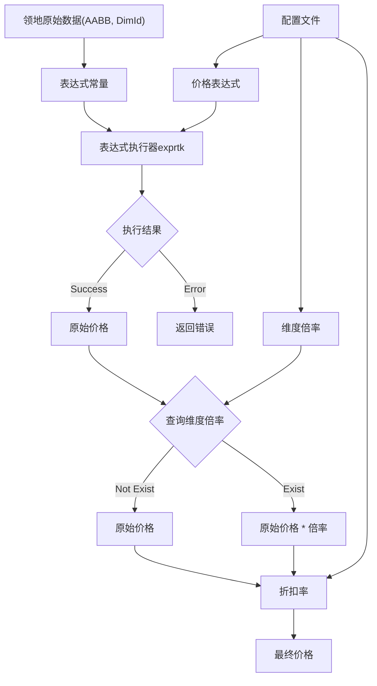

# FAQ & 疑问解答

## 领地权限划分？

插件划分了 4 个权限等级，分别是：

`Operator`：**操作员**，拥有所有权限，包括创建、删除、修改领地等。  
`Owner`：**领地主人**，拥有领地内所有权限，包括创建、删除、修改领地等。  
`Member`：**成员**，拥有领地内部分权限，包括进入领地、破坏方块等 (不包含领地管理器 GUI 权限)。  
`Guest`：**访客**，拥有领地内最少的权限，包括进入领地。

## 价格表达式处理流程

## 如何迁移领地数据？

迁移时，你需要将旧服务端 `plugins/PLand` 文件夹下的 `config` 和 `data` 文件夹复制到新服务端 `plugins/PLand`
文件夹下，然后重启服务器即可。

## 如何查看数据库？ （数据库可视化）

PLand 的数据存储使用 Google 的 LevelDB 数据库，你可以使用 [QLevelDBViewer](https://github.com/engsr6982/QLevelDBViewer)
来查看数据库内容。

> Tip:  
> 从 PLand v0.5.0 开始，PLand 内置了一个 `DevTool` 工具  
> 如果您的设备拥有显示器(仅限 Windows 桌面环境)，可以在 `Config.internals.devTool` 中开启这个工具  
> 然后使用 `/pland devtool` 唤起窗口，插件将会创建一个 Windows 窗口提供运行时可视化修改、查看。

!> 请不要随意修改数据库内容，否则会导致插件反射异常，无法加载领地数据。

## 关于子领地

> [[Feature]: 子领地支持 #18](https://github.com/engsr6982/PLand/issues/18)

| 状态       | 父领地 | 子领地 | 备注                |
|----------|-----|-----|-------------------|
| **普通领地** | ×   | ×   | 无**父领地**、无**子领地** |
| **父领地**  | ×   | √   | 无**父领地**、有**子领地** |
| **混合领地** | √   | √   | 有**父领地**、有**子领地** |
| **子领地**  | √   | ×   | 有**父领地**、无**子领地** |

1. **子领地** 独立于 **父领地**
2. 由于嵌套的复杂性，**子领地** 不支持 **重新选区**
3. **删除领地** 仅在部分情况下显示
    - **父领地**：**全部删除**、或者提升 **子领地** 为 **普通领地**
    - **混合领地**，移除所有 **子领地**，或者仅移除当前 **中间层**，并将子领地移交 **父领地** 中
    - **子领地** 按照默认逻辑处理
4. **子领地** 支持多级嵌套，但最大层级不能超过 `Config` 中 `maxNested` 的值
    - `maxNested` 不能超过插件的 `GlobalSubLandMaxNestedLevel` 值
5. **子领地** 创建使用独立命令 `pland new sub_land` 创建
    - **子领地** 只能为 3D 领地
    - 开启 **子领地** 选区器后，**父领地** 渲染为红色，**子领地** 不能超过这个范围
    - **子领地** 最大可用范围受直系 **父领地** 范围限制
6. 当玩家所在位置有**多级**领地嵌套时，**子领地** 优先级高于 **父领地**

## 关于遥测

> [[Feature]: 增加遥测支持 ](https://github.com/engsr6982/PLand/issues/90)

- Q: 遥测会收集哪些数据？

遥测仅收集以下数据：

1. 插件版本
2. 服务器版本
3. 加载器版本
4. 玩家数量
5. 玩家平台
6. 在线模式
7. 核心数量
8. 操作系统

- Q: 遥测数据会发送到哪里？

所有数据都会匿名发送到 [bStats](https://bstats.org/plugin/bukkit/LeviLamina_PLand/27389)，用于统计插件使用情况。

- Q: 我可以关闭遥测吗？

当然可以，你可以在 `config.json` 中关闭遥测功能 `Config.internals.telemetry`。

- Q: 遥测会收集额外的敏感信息吗？

不会，遥测仅收集上述数据，不会收集任何敏感信息。

当然，如果您不放心，可以查看 PLand 的源代码，确认遥测功能不会收集任何敏感信息。
